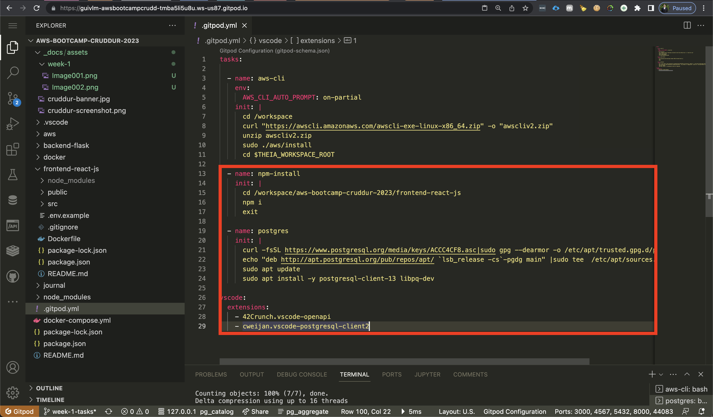

# Week 1 — App Containerization

### Launch the repo within a Gitpod workspace

**Notes:** Repositories created by using Git Bash rather than the user interface.

---

### Configure Gitpod.yml configuration, eg. VSCode Extensions

**Notes:** npm installation, Postgres libraries, and VS Code extension added to the GitPod.yml file in order to install these whenever the web experience is refreshed. 
I learned that when GitBash is refreshed, it does not install npm automatically within the front-end folder, causing the React libraries to fail when mounting the docker image.

---

### Clone the frontend and backend repo

---

### Explore the codebases

**Notes:** It was a great opportunity to understand how ReactJS works, how the Front-End interacts with the BackEnd, how the files and libraries has been imported.

---

### Ensure we can get the apps running locally

**Notes:** Individual containers have been created (front-end and back-end) and ran locally. Also, it was an opportunity to explore the backend APIs individually plus the front-end navigation with react, with some challenges, such as CORS, and React libraries.

---

### Write a Dockerfile for each app

---

### Ensure we get the apps running via individual container

**Notes:** A great opportunity here to explore the container logs which expands the possibility for debugging. When I set the container up, I figured out that the ReactJS libraries weren't loading and these logs were fundamental to figuring out the problem.

---

### Create a docker-compose file

**Notes:** Opportunity to understand how to orchestrate multiple containers at once besides managing different HTTP ports.

---

### Ensure we can orchestrate multiple containers to run side by side

---

### Mount directories so we can make changes while we code

---

### Containerize Application (Dockerfiles, Docker Compose)

**Notes:** Individual containers weren't live updated while I was making edits, while when setting up the docker-compose file it updated changes live.

---

### Document the Notification Endpoint for the OpenAI Document	

**Notes:** It was a great opportunity for learning more regarding OpenAPI 3.0, besides the fact to view the Swagger updating live as part of a VSCode extension.

---

### Write a Flask Backend Endpoint for Notifications

---

### Write a React Page for Notifications

---

### Run DynamoDB Local Container and ensure it works

---

### Run Postgres Container and ensure it work

**Notes:** The most challenging task was to set the Postgres to run locally due to permissions issues.