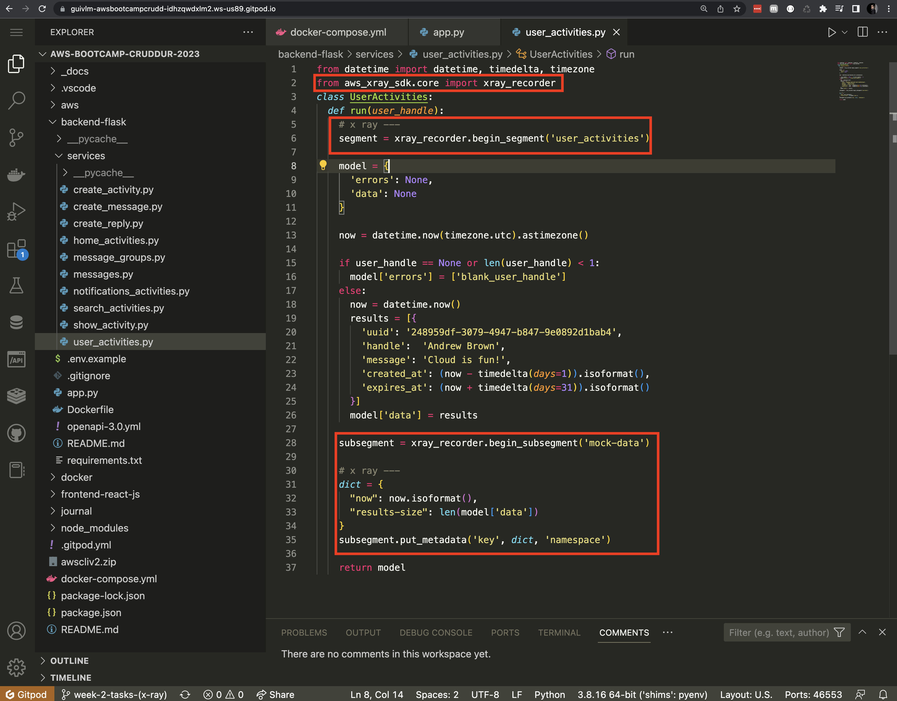

# Week 2 — Distributed Tracing

### Instrument our backend flask application to use Open Telemetry (OTEL) with Honeycomb.io as the provider

---

### Run queries to explore traces within Honeycomb.io

---

### Instrument AWS X-Ray into backend flask application

---

### Configure and provision X-Ray daemon within docker-compose and send data back to X-Ray API

---

### Observe X-Ray traces within the AWS Console

---

### Integrate Rollbar for Error Logging

---

### Trigger an error an observe an error with Rollbar

---

### Install WatchTower and write a custom logger to send application log data to CloudWatch Log group

