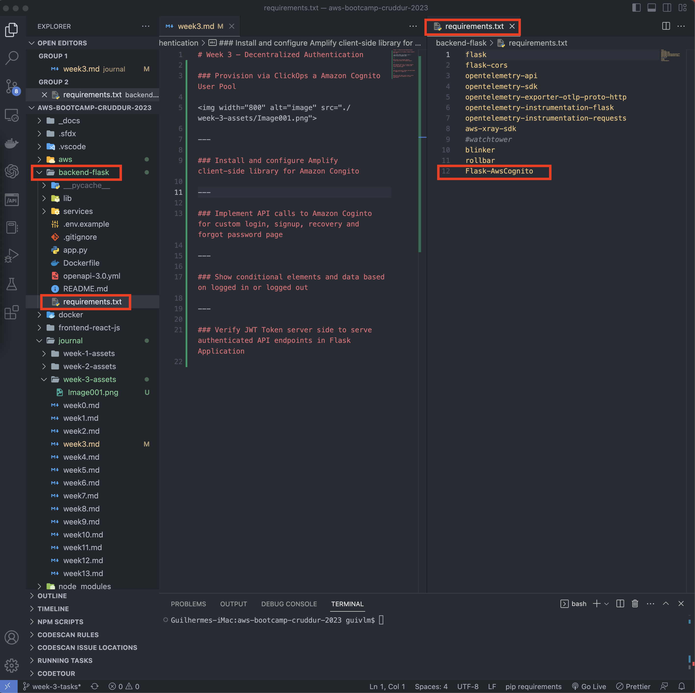
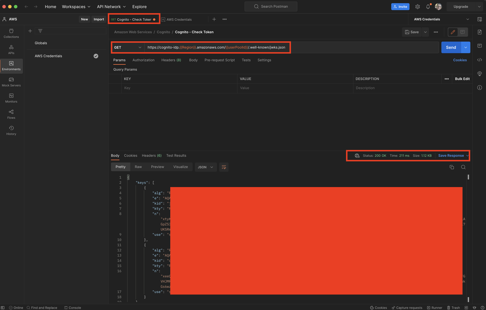
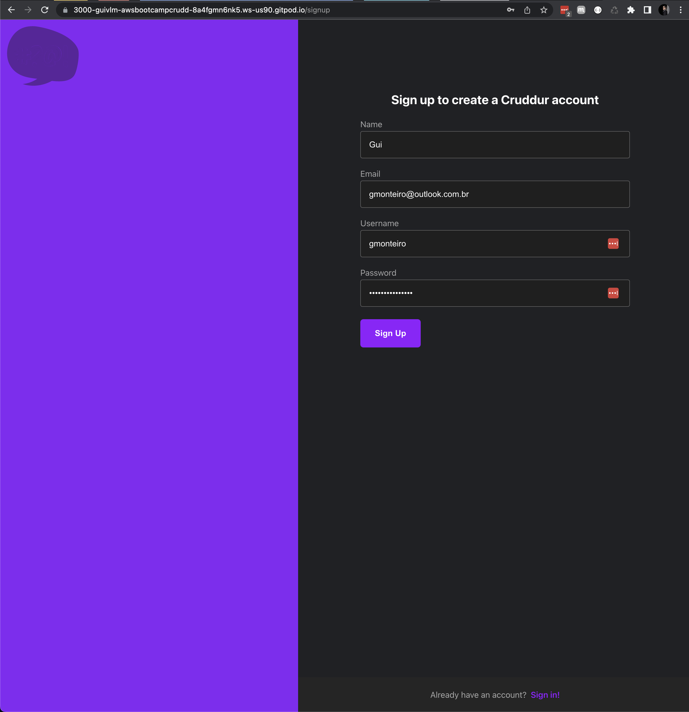

# Week 3 — Decentralized Authentication

### Provision via ClickOps a Amazon Cognito User Pool:

---

### Install and configure Amplify client-side library for Amazon Congito:

---

### Implement API calls to Amazon Coginto for custom login, signup, recovery and forgot password page:

---

### Show conditional elements and data based on logged in or logged out:

---

### Verify JWT Token server side to serve authenticated API endpoints in Flask Application:

---

### Results:

