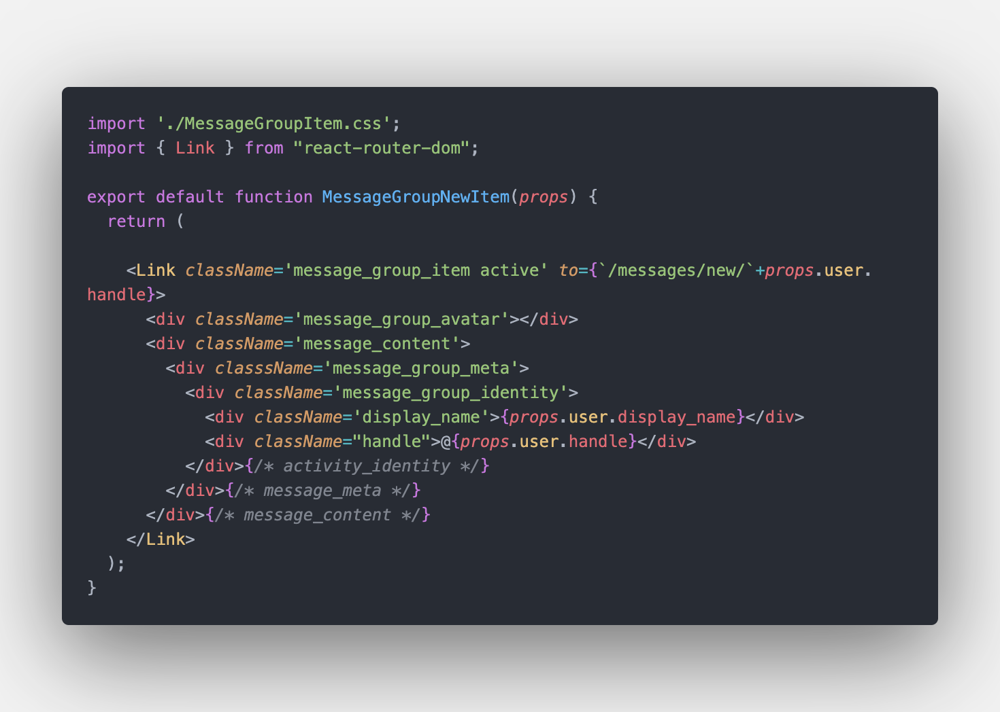

# Week 5 — DynamoDB and Serverless Caching

### Update libraries to Import

---

### Implement Schema Load Script

---

### Implement Seed Script

---

### Implement Scan Scripts

---

### Implement Pattern Scripts for Read and List Conversations

---

### Implement Update Cognito ID Script for Postgres Database

---

### Implement (Pattern A) Listing Messages in Message Group into Application

### Implement (Pattern B) Listing Messages Group into Application

### Implement (Pattern B) Listing Messages into Application

---

### Implement (Pattern C) Creating a Message for an existing Message Group into Application

### Implement (Pattern D) Creating a Message for a new Message Group into Application

---

### Implement (Pattern E) Updating a Message Group using DynamoDB Streams

---
